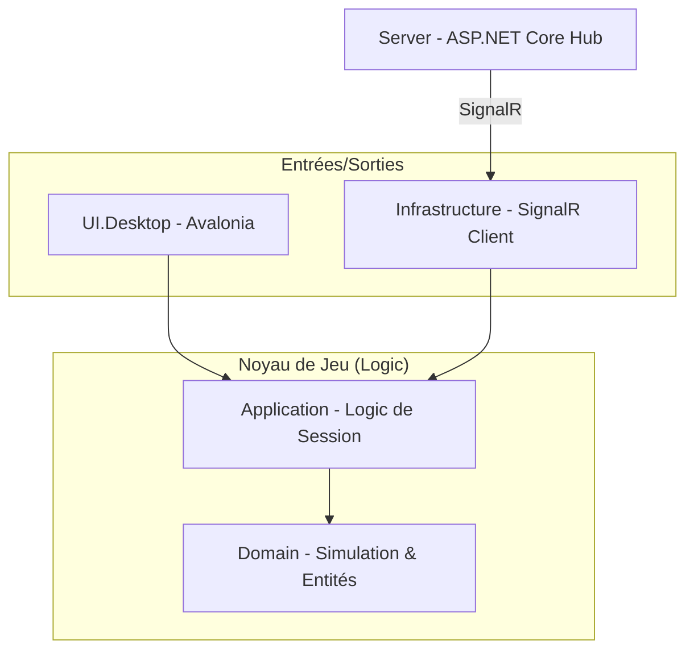
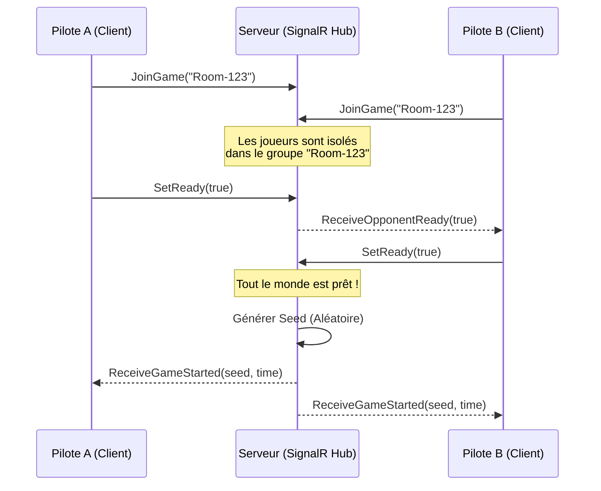
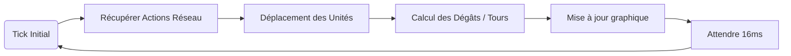

# Dossier de Présentation : TowerFluffy

Ce document contient les schémas techniques et les arguments clés pour votre passage à l'oral.

---

## 1. Architecture Globale (Clean Architecture)
Nous avons séparé le projet en couches pour garantir que la logique de jeu est indépendante de l'interface graphique et du réseau.

**Argument oral :** *"Nous avons utilisé une Clean Architecture. Si demain nous voulons passer d'Avalonia à Unity ou du SignalR au WebSockets pur, le Noyau de Jeu (Domain) ne changerait pas d'une seule ligne."*

---

## 2. Communication Réseau (Groupes & Temps Réel)
Le multijoueur repose sur SignalR avec une gestion de salles (Game IDs).

**Argument oral :** *"La gestion des salles est sécurisée via les Groupes SignalR. Les joueurs ne reçoivent que les données tactiques de leur propre opération, ce qui optimise la bande passante."*

---

## 3. Boucle de Simulation (Tick Rate)
Pour éviter la désynchronisation, le jeu tourne à 60 Ticks par seconde.

**Argument oral :** *"Le moteur de simulation est déterministe. Avec la même 'Seed' et le même timing, les deux joueurs voient exactement la même bataille se dérouler sur leurs écrans respectifs."*

---

## 4. Points Forts du Projet
- **Asymétrie Tactique** : Un rôle Défenseur (gestion de base) et un rôle Attaquant (stratégie d'invasion).
- **Design Immersif** : Interface "High-Tech Tactical HUD" développée avec SukiUI.
- **Robustesse** : Utilisation du protocole binaire **MessagePack** pour des échanges réseau ultra-rapides.
- **Multi-plateforme** : Code .NET 9 compatible Windows, Linux et macOS.

---

## 5. Démo : Scénario Idéal
1. **Connexion** : Montrer l'UPLINK automatique.
2. **Lobby** : Créer une salle "EXAMEN-2026".
3. **Préparation** : Choisir les rôles, cliquer sur "Prêt".
4. **Gameplay** : Poser une tour, envoyer une vague, et montrer la barre de vie qui descend en temps réel sur les deux écrans.
